# 🚀 Deep Space — Number Guessing Game | Full Cloud DevOps Pipeline

> A complete end-to-end **CI/CD + GitOps + Monitoring** project built on AWS EC2, Jenkins, Docker, Kubernetes (K3s), ArgoCD, Prometheus, and Grafana.

[](http://54.163.20.147:8080)
[](https://hub.docker.com/r/vishal1326/guessing-game)
[]()
[]()
[]()
[]()

---

## 📋 Table of Contents

1. [Project Overview](#project-overview)
2. [Architecture](#architecture)
3. [Tech Stack](#tech-stack)
4. [Infrastructure — AWS EC2](#infrastructure--aws-ec2)
5. [CI Pipeline — Jenkins](#ci-pipeline--jenkins)
6. [CD Pipeline — ArgoCD + Kubernetes](#cd-pipeline--argocd--kubernetes)
7. [Monitoring — Prometheus + Grafana](#monitoring--prometheus--grafana)
8. [Kubernetes Services & Ports](#kubernetes-services--ports)
9. [AWS Security Group Rules](#aws-security-group-rules)
10. [Application](#application)
11. [Repository Structure](#repository-structure)
12. [How to Reproduce](#how-to-reproduce)

---

## 🎯 Project Overview

This project demonstrates a **production-grade DevOps pipeline** for a containerized web application called **Deep Space — Coordinate Lock Protocol**, a space-themed number guessing game (v2.4.1).

The pipeline covers the complete software delivery lifecycle:

- **Source** → GitHub
- **Build & Test** → Jenkins (SonarQube analysis + Docker build)
- **Registry** → DockerHub (`vishal1326/guessing-game`)
- **Deploy** → Kubernetes (K3s) via ArgoCD GitOps
- **Monitor** → Prometheus + Grafana (kube-prometheus-stack)

---

## 🏗️ Architecture

```
Developer
    │
    ▼
GitHub (main branch)
    │
    ├──► Jenkins CI Pipeline (CI-JENKINS-SERVER)
    │        │
    │        ├── 1. Checkout SCM        (0.25s)
    │        ├── 2. SonarCloud Analysis  (33s)
    │        ├── 3. Docker Build          (1s)
    │        └── 4. Docker Push           (5s)
    │                │
    │                ▼
    │         DockerHub Registry
    │         vishal1326/guessing-game:latest
    │
    └──► ArgoCD watches GitHub repo
             │
             ▼
        K3s Kubernetes (CD-KUBERNETES-SERVER)
             │
             ├── Deployment: guessing-game
             ├── Service: guessing-game  ──► NodePort ✦ 30007  (App)
             ├── ArgoCD Server           ──► NodePort ✦ 32729  (GitOps UI)
             ├── Grafana                 ──► NodePort ✦ 30332  (Dashboards)
             └── Prometheus              ──► NodePort ✦ 32443  (Metrics)
```

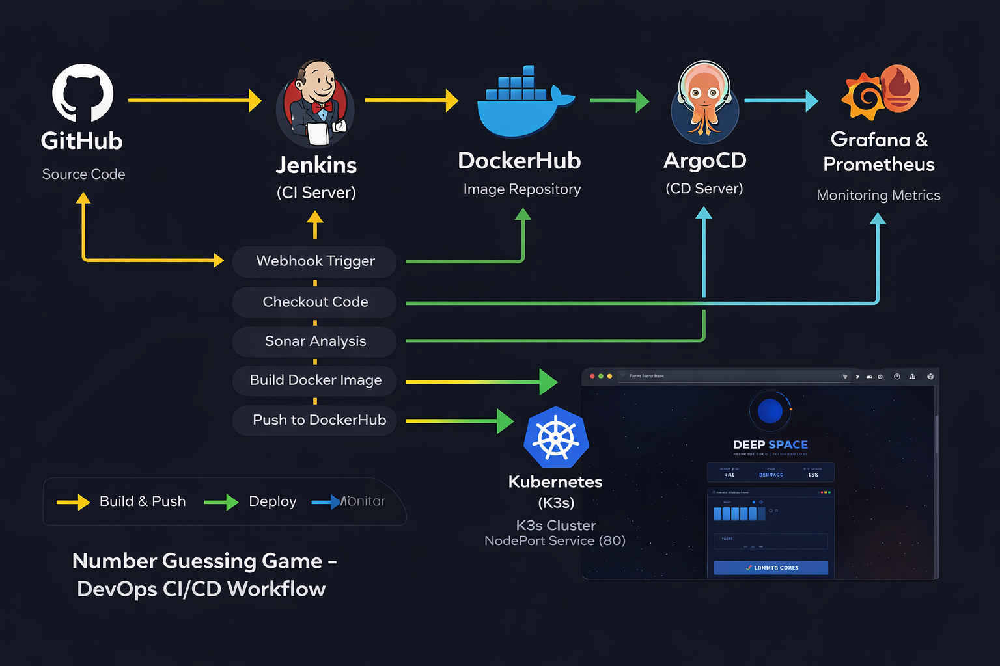

---

## 🛠️ Tech Stack

| Category | Tool | Version |
|---|---|---|
| Cloud Provider | AWS EC2 | us-east-1b |
| Instance Type | c7i.flex.large | — |
| OS | Ubuntu 24.04 (Noble) | — |
| CI Server | Jenkins | 2.541.3 |
| Container Runtime | Docker | 28.2.2 |
| Container Registry | DockerHub | — |
| Kubernetes | K3s | v1.34.5+k3s1 |
| GitOps | ArgoCD | v3.3.4 |
| Code Quality | SonarCloud | Scanner 8.0.1.6346 |
| Package Manager (K8s) | Helm | v3.20.1 |
| Monitoring Stack | kube-prometheus-stack | — |
| Metrics | Prometheus | Active |
| Dashboards | Grafana | v12.4.1 |
| Java (Jenkins) | OpenJDK | 21 |

---

## 🖥️ Infrastructure — AWS EC2

Two dedicated EC2 instances — both `c7i.flex.large`, `us-east-1b`, **3/3 status checks passed** ✅

| Instance Name | Instance ID | Role | Public IP |
|---|---|---|---|
| **CI-JENKINS-SERVER** | i-0adbbf5fae0771b4e | Jenkins CI | 54.163.20.147 |
| **CD-KUBERNETES-SERVER** | i-0ce5af51b511204d2 | K3s + ArgoCD + Monitoring | 18.206.245.80 |

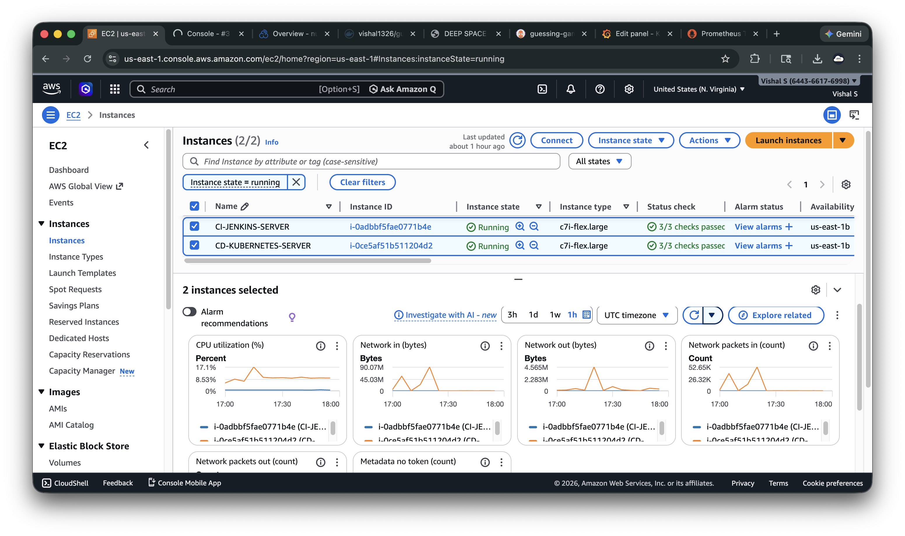

---

## ⚙️ CI Pipeline — Jenkins

Jenkins `2.541.3` runs on **CI-JENKINS-SERVER** at `54.163.20.147:8080`.

### Jenkins Setup

```bash
sudo apt update
sudo apt install fontconfig openjdk-21-jre -y
sudo apt install jenkins -y
sudo apt install docker.io -y
sudo usermod -aG docker jenkins
sudo systemctl restart jenkins
```

### Credentials Configured

| Credential ID | Purpose |
|---|---|
| `dockerhub-creds` | Push image to DockerHub |
| `github-creds` | Checkout source from GitHub |
| `sonar-token` | SonarCloud code quality analysis |

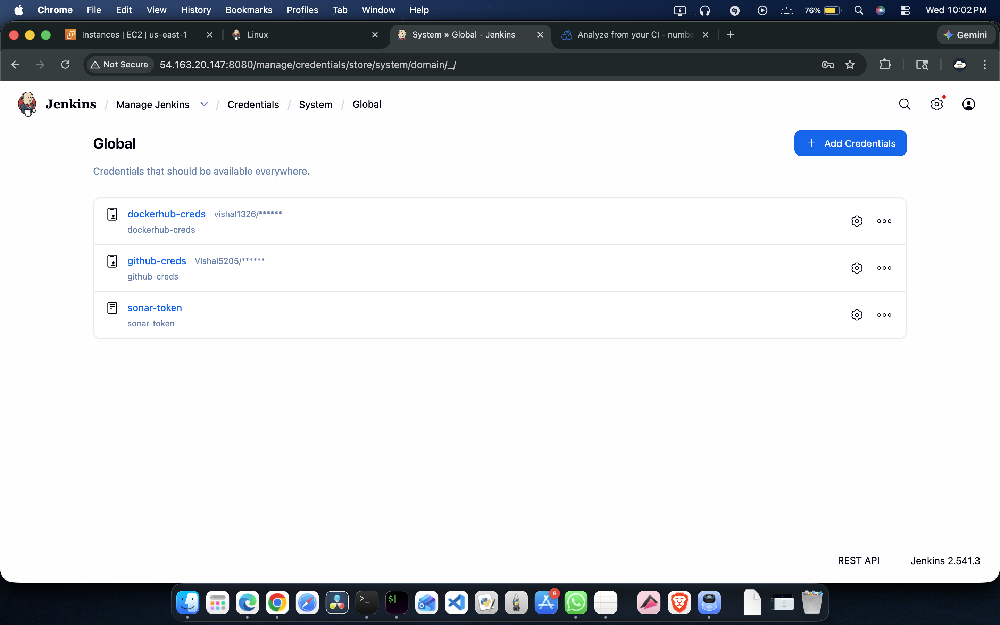

### Plugins Installed

- **Docker Pipeline** `634.vedc7242b_eda_7`
- **SonarQube Scanner** `2.18.2`

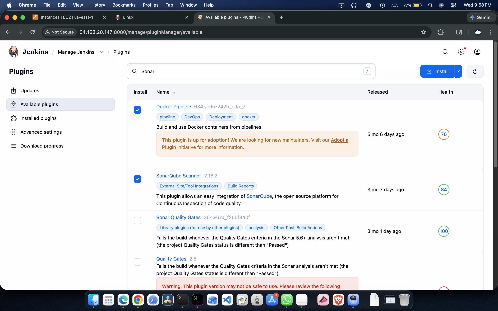

### Pipeline Stages — Build #3 ✅ (44 sec total)

```
Start → Checkout SCM (0.25s) → SonarCloud Analysis (33s) → Docker Build (1s) → Docker Push (5s) → End
```

- Git Revision: `47f32583c6160e91c19a898b3c938c01d5b88b4c`
- Branch: `refs/remotes/origin/main`
- Triggered by: **Devops**

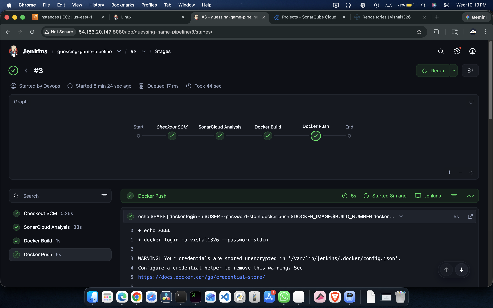

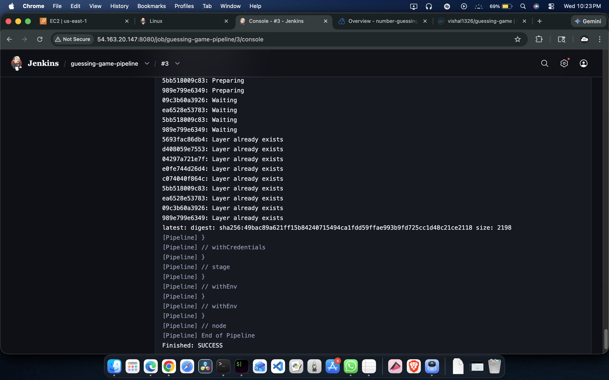

### DockerHub — Image Published

`vishal1326/guessing-game` — **4 tags**, **91 pulls**

| Tag | Pushed |
|---|---|
| `latest` | ~9 min ago |
| `3` | ~9 min ago |
| `7` | ~2 hours ago |
| `10` | ~8 hours ago |

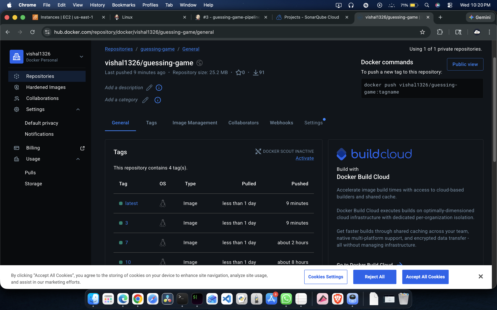

---

## 🔄 CD Pipeline — ArgoCD + Kubernetes

### K3s Setup

```bash
# Install K3s
curl -sfL https://get.k3s.io | sh -

# Fix kubeconfig permissions
sudo chmod 644 /etc/rancher/k3s/k3s.yaml

# Verify node
kubectl get nodes
# NAME                  STATUS   ROLES           VERSION
# cdkubernetiesserver   Ready    control-plane   v1.34.5+k3s1
```

### ArgoCD Install

```bash
kubectl create namespace argocd
kubectl apply -n argocd \
  -f https://raw.githubusercontent.com/argoproj/argo-cd/stable/manifests/install.yaml

# Patch to NodePort ✦ 32729
kubectl patch svc argocd-server -n argocd \
  -p '{"spec": {"type": "NodePort"}}'

# Get admin password
kubectl -n argocd get secret argocd-initial-admin-secret \
  -o jsonpath="{.data.password}" | base64 -d
```

### ArgoCD Application Status

| Field | Value |
|---|---|
| App Health | ✅ **Healthy** |
| Sync Status | ✅ **Synced** to `main (47f3258)` |
| Auto-Sync | **Enabled** |
| Last Sync | Wed Mar 18 2026, 22:43:35 GMT+0530 |
| Commit | `Create service.yaml` |

**Resource Tree:** `guessing-game (app)` → `svc + deployment` → `ReplicaSets` → `Pod (1/1 Running)`

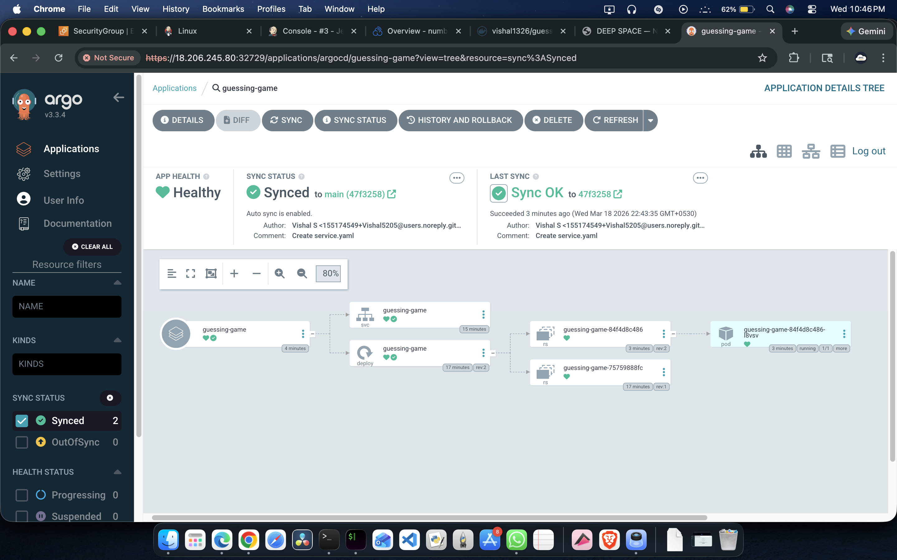

---

## 📊 Monitoring — Prometheus + Grafana

### Install via Helm

```bash
# Install Helm
curl https://raw.githubusercontent.com/helm/helm/main/scripts/get-helm-3 | bash

# Add Prometheus community chart
helm repo add prometheus-community \
  https://prometheus-community.github.io/helm-charts
helm repo update

# Install kube-prometheus-stack
kubectl create namespace monitoring
helm install monitoring prometheus-community/kube-prometheus-stack \
  --namespace monitoring

# Expose Grafana ──► NodePort ✦ 30332
kubectl patch svc monitoring-grafana -n monitoring \
  -p '{"spec": {"type": "NodePort"}}'

# Expose Prometheus ──► NodePort ✦ 32443
kubectl patch svc monitoring-kube-prometheus-prometheus -n monitoring \
  -p '{"spec": {"type": "NodePort"}}'

# Get Grafana admin password
kubectl get secret --namespace monitoring monitoring-grafana \
  -o jsonpath="{.data.admin-password}" | base64 --decode
```

### Prometheus — All Targets Healthy

All **13 scraped targets** returning `up = 1` ✅

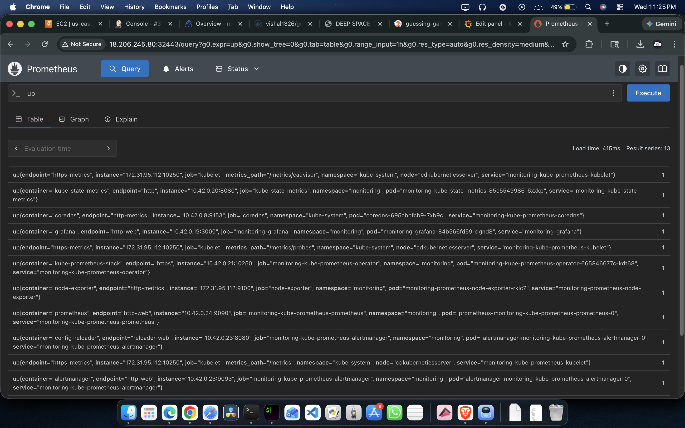

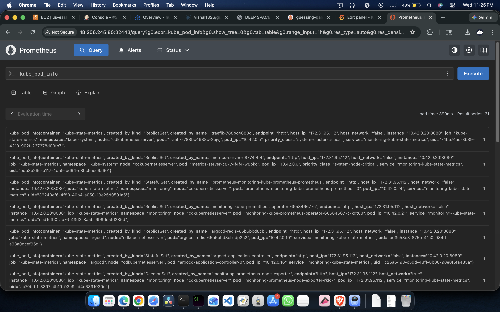

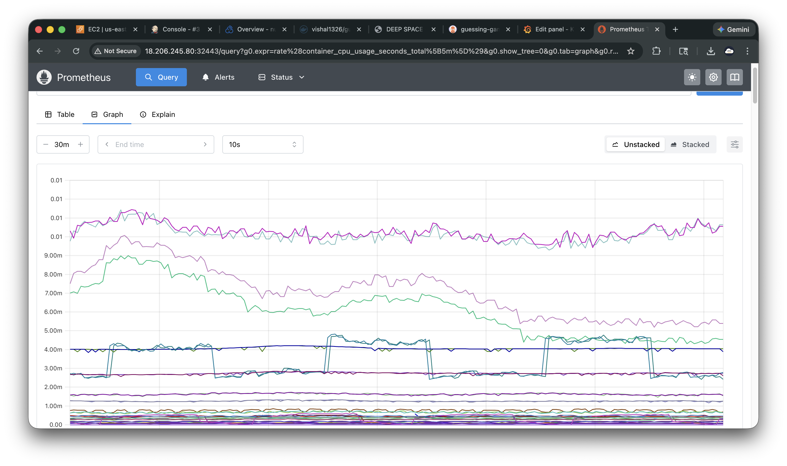

### Grafana — CPU Usage Dashboard

- **Dashboard:** Kubernetes / Compute Resources / Pod
- **Namespace:** `default`
- **Pod:** `guessing-game-84f4d8c486-l8vsv`
- **Metric:** `node_namespace_pod_container:container_cpu_usage_seconds_total:sum_rate5m`
- **Grafana Version:** v12.4.1

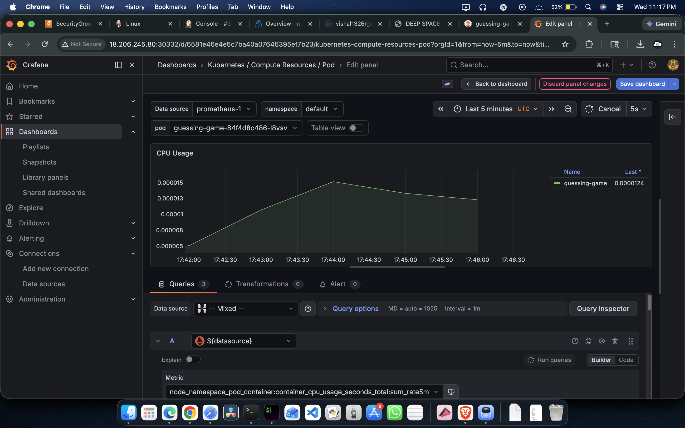

---

## 🔌 Kubernetes Services & Ports

### `default` Namespace

| Service | Type | Cluster-IP | NodePort | Purpose |
|---|---|---|---|---|
| `guessing-game` | **NodePort** | 10.43.32.59 | **✦ 30007** | 🎮 App — Public Access |
| `kubernetes` | ClusterIP | 10.43.0.1 | 443 | Internal API |

### `argocd` Namespace

| Service | Type | Cluster-IP | Port(s) | NodePort |
|---|---|---|---|---|
| `argocd-server` | **NodePort** | 10.43.78.31 | 80, 443 | **✦ 32729** |
| `argocd-applicationset-controller` | ClusterIP | 10.43.110.217 | 7000, 8080 | — |
| `argocd-dex-server` | ClusterIP | 10.43.50.118 | 5556–5558 | — |
| `argocd-metrics` | ClusterIP | 10.43.163.155 | 8082 | — |
| `argocd-redis` | ClusterIP | 10.43.163.99 | 6379 | — |
| `argocd-repo-server` | ClusterIP | 10.43.28.40 | 8081, 8084 | — |
| `argocd-notifications-controller-metrics` | ClusterIP | 10.43.35.249 | 9001 | — |
| `argocd-server-metrics` | ClusterIP | 10.43.18.149 | 8083 | — |

### `monitoring` Namespace

| Service | Type | Cluster-IP | Port(s) | NodePort |
|---|---|---|---|---|
| `monitoring-grafana` | **NodePort** | 10.43.133.51 | 80 | **✦ 30332** |
| `monitoring-kube-prometheus-prometheus` | **NodePort** | 10.43.184.130 | 9090, 8080 | **✦ 32443** |
| `monitoring-kube-prometheus-alertmanager` | ClusterIP | 10.43.187.166 | 9093, 8080 | — |
| `monitoring-kube-prometheus-operator` | ClusterIP | 10.43.77.199 | 443 | — |
| `monitoring-kube-state-metrics` | ClusterIP | 10.43.184.56 | 8080 | — |
| `monitoring-prometheus-node-exporter` | ClusterIP | 10.43.236.56 | 9100 | — |
| `alertmanager-operated` | ClusterIP | None | 9093, 9094 | — |
| `prometheus-operated` | ClusterIP | None | 9090 | — |

---

## 🔐 AWS Security Group Rules

Security Group: `sg-0196aa0e7398713e5` (`launch-wizard-7`) — **6 inbound rules**:

| Port | Protocol | Purpose |
|---|---|---|
| `22` | SSH | EC2 remote access |
| **`30007`** | Custom TCP | 🎮 **Guessing Game App** |
| **`30332`** | Custom TCP | 📊 **Grafana Dashboard** |
| `31260` | Custom TCP | Initial app NodePort |
| **`32443`** | Custom TCP | 🔍 **Prometheus** |
| **`32729`** | Custom TCP | 🔄 **ArgoCD UI** |

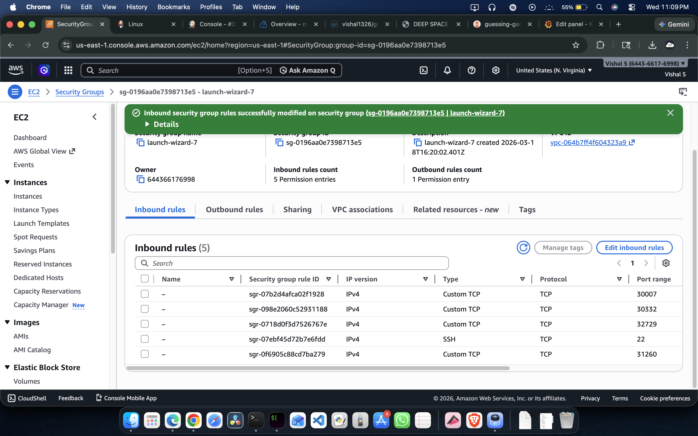

---

## 🎮 Application

**Deep Space — Coordinate Lock Protocol** (`v2.4.1`)

- **URL:** `http://18.206.245.80:30007`
- **Gameplay:** Guess the secret coordinate between 001–100 in 5 reactor core attempts
- **Status:** `TRANSMISSION LIVE` ✅

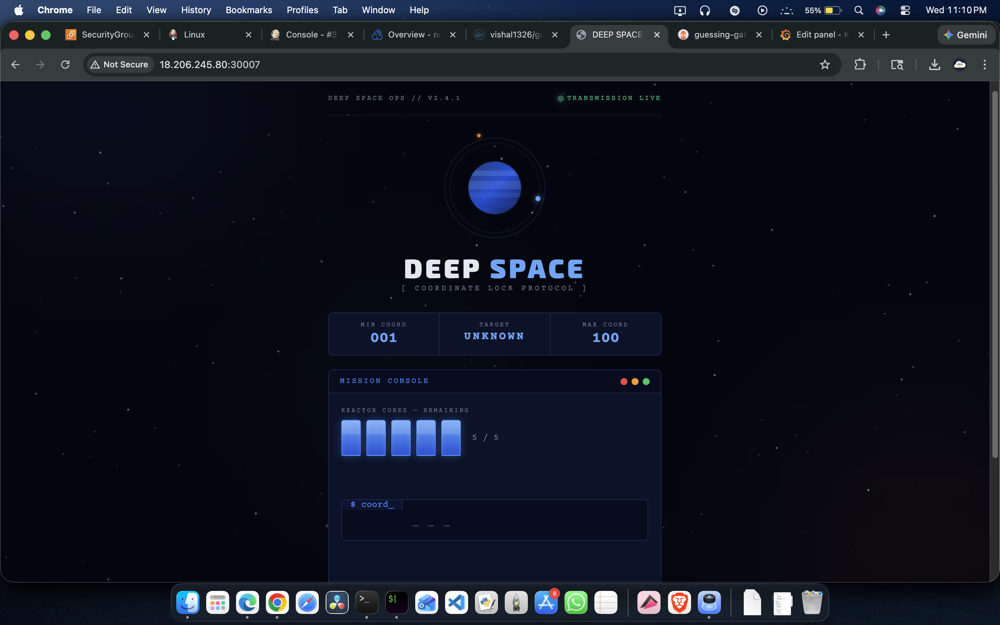

---

## 📁 Repository Structure

```
number-guessing-game/
├── index.html           # Game frontend (Deep Space UI)
├── Dockerfile           # Container definition
├── Jenkinsfile          # CI pipeline (Checkout → Sonar → Build → Push)
├── k8s/
│   ├── deployment.yaml  # Kubernetes Deployment manifest
│   └── service.yaml     # Kubernetes Service (NodePort 30007)
└── screenshots/         # All project screenshots
```

---

## 🔁 How to Reproduce

### 1. Launch EC2 Instances
- 2x `c7i.flex.large`, Ubuntu 24.04, `us-east-1b`
- Security group ports: `22, 8080, 30007, 30332, 31260, 32443, 32729`

### 2. Set Up Jenkins (CI Server)
```bash
sudo apt update && sudo apt install fontconfig openjdk-21-jre jenkins docker.io -y
sudo usermod -aG docker jenkins
sudo systemctl restart jenkins
```
- Install plugins: **Docker Pipeline**, **SonarQube Scanner**
- Add credentials: `dockerhub-creds`, `github-creds`, `sonar-token`

### 3. Set Up K3s (CD Server)
```bash
curl -sfL https://get.k3s.io | sh -
sudo chmod 644 /etc/rancher/k3s/k3s.yaml
```

### 4. Install ArgoCD
```bash
kubectl create namespace argocd
kubectl apply -n argocd \
  -f https://raw.githubusercontent.com/argoproj/argo-cd/stable/manifests/install.yaml
kubectl patch svc argocd-server -n argocd -p '{"spec": {"type": "NodePort"}}'
```

### 5. Install Monitoring Stack
```bash
curl https://raw.githubusercontent.com/helm/helm/main/scripts/get-helm-3 | bash
helm repo add prometheus-community \
  https://prometheus-community.github.io/helm-charts
helm repo update
kubectl create namespace monitoring
helm install monitoring prometheus-community/kube-prometheus-stack \
  --namespace monitoring
kubectl patch svc monitoring-grafana -n monitoring \
  -p '{"spec": {"type": "NodePort"}}'
kubectl patch svc monitoring-kube-prometheus-prometheus -n monitoring \
  -p '{"spec": {"type": "NodePort"}}'
```

### 6. Connect ArgoCD to Repo
- Open `http://18.206.245.80:32729`
- Create app → repo: `https://github.com/Vishal5205/number-guessing-game`
- Enable **Auto-Sync**

---

## 👤 Author

**Vishal S** — Cloud DevOps Engineer  
GitHub: [@Vishal5205](https://github.com/Vishal5205) | [number-guessing-game repo](https://github.com/Vishal5205/number-guessing-game)  
DockerHub: [vishal1326](https://hub.docker.com/u/vishal1326)

---

*Built on AWS EC2 · Jenkins · Docker · Kubernetes K3s · ArgoCD · Prometheus · Grafana · SonarCloud*
